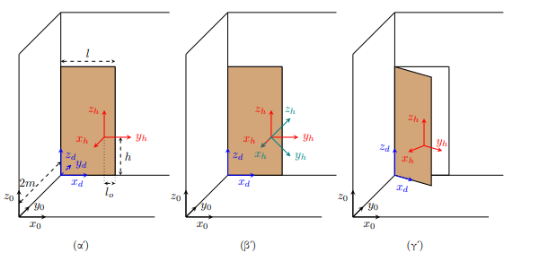
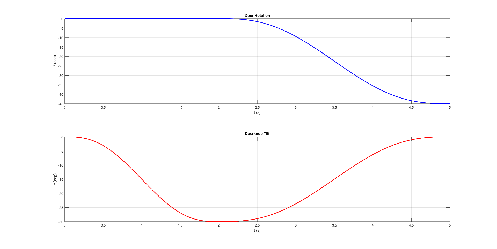
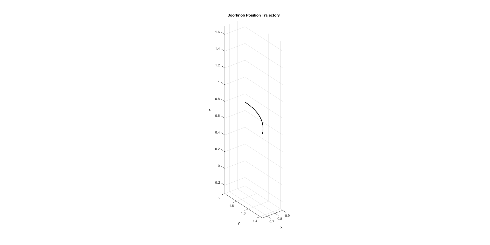
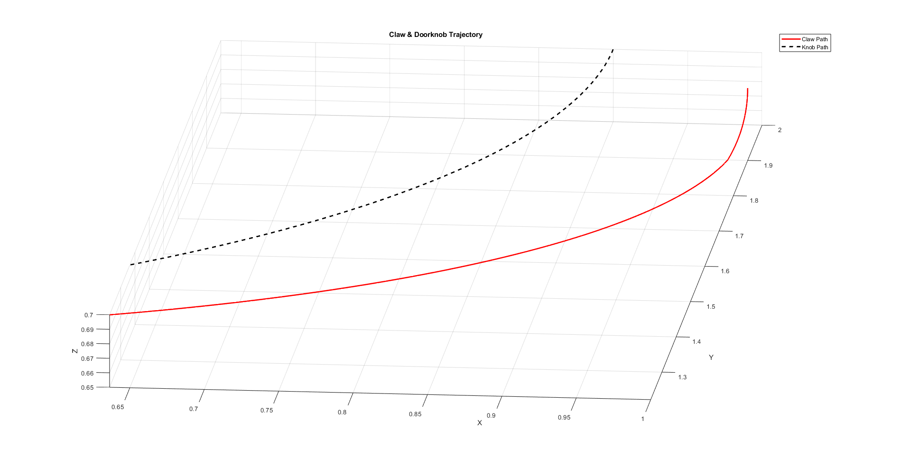
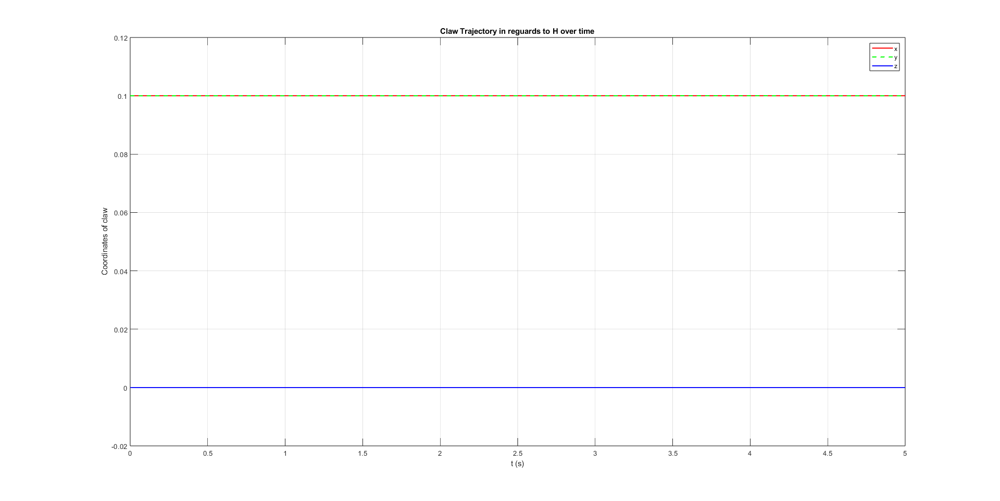
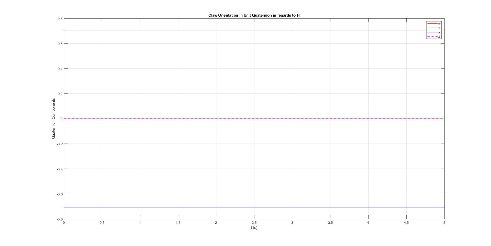
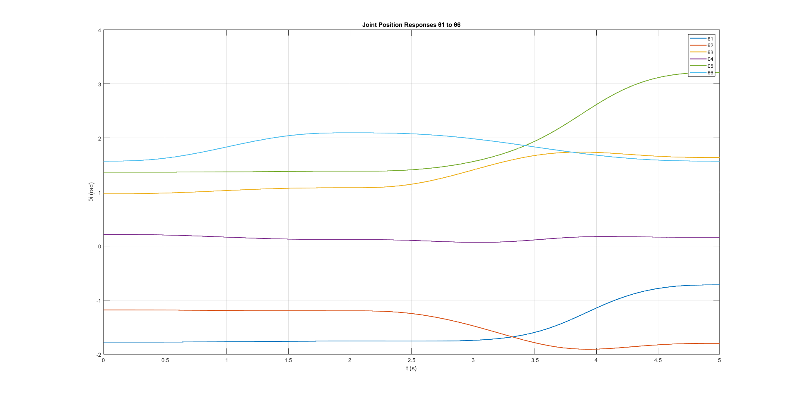
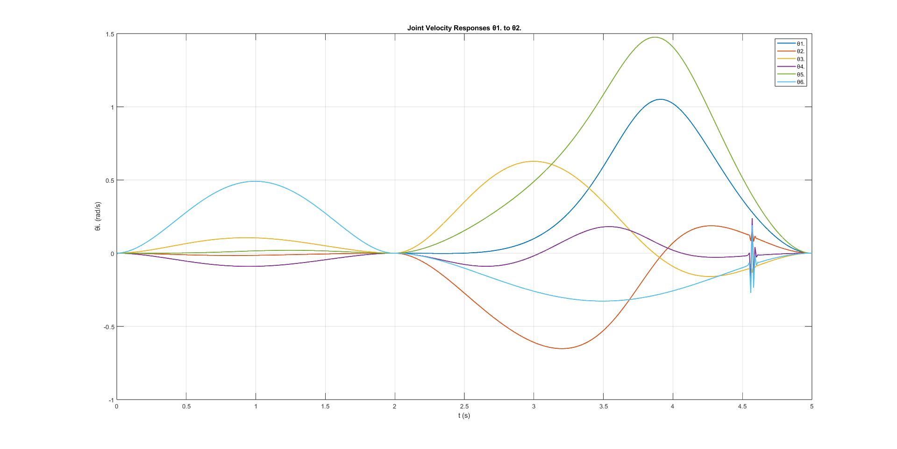

# Εργασία Ρομποτικής - Άνοιγμα Πόρτας με Βραχίωνα 6 Βαθμών Ελευθερίας

Κατσάρος Ζήσης, 10666

## Εισαγωγή
Η παρούσα εργασία αφορά το άνοιγμα μίας πόρτας με ρομποτικό βραχίωνα 6 βαθμών ελευθερίας. Στο τμήμα *Α* θα σχεδιαστεί η τροχιά που πρέπει να ακολουθήσει το πόμολο ούτως ώστε η πόρτα να ξεκλειδώσει και να ανοίξει. Στο τμήμα *Β* θα εισαχθεί ο βραχίωνας `ur10` και θα σχεδιαστούν κατάλληλες εντολές ταχύτητας των αρθρώσεών του ώστε το άκρο του να ξεκλειδώσει και να ανοίξει την πόρτα σύμφωνα με την τροχιά που σχεδιάστηκε στο πρώτο μέρος. Στις παρακάτω ενότητες, λοιπόν, θα γίνει μαθηματική περιγραφή της επίλυσης του προβλήματος, θα αναλυθεί η αλγοριθμική υλοποίηση αυτής μέσω `script` σε `MATLAB` και θα παρουσιαστούν γραφήματα τα οποία οπτικοποιούν σημαντικά σημεία της διαδικασίας.

## Τμήμα *Α* - Σχεδίαση Τροχιάς Πόμολου
Όπως προαναφέρθηκε, στο πρώτο τμήμα της εργασίας θα σχεδιαστεί η τροχιά του πόμολου της πόρτας. Πιο συγκεκριμένα, το πόμολο πρέπει να στραφεί κατά $30^\circ$ γύρω από άξονα κάθετο στην πόρτα και έπειτα η πόρτα πρέπει να στραφεί κατά $45^\circ$ έτσι ώστε να ανοίξει προς το εσωτερικό του δωματίου. Παράλληλα με το άνοιγμα της πόρτας το πόμολο πρέπει να στραφεί με φορά αντίθετη από αυτήν της προηγούμενης περιστροφής, ώστε να έρθει στην αρχική του θέση.

Η κίνηση αυτή πρέπει να διαρκεί $T=5\,s$, ενώ το πόμολο και η πόρτα θα πρέπει να αρχίσουν και να τελειώσουν την κίνηση με μηδενική ταχύτητα και επιτάχυνση. Ακολουθεί μαθηματική και αλγοριθμική σχεδίαση της τροχιάς σύμφωνα με τα παραπάνω.

### Μαθηματική Περιγραφή
Η σχεδίαση μπορεί να χωριστεί σε δύο βασικά ζητήματα. Πρώτον, πρέπει να οριστεί ο ομογενής Μ/Σ του πλαισίου του πόμολου $\{H\}$ ως προς το πλαίσιο $\{0\}$, ο οποίος θα εξαρτάται από δύο γωνίες $\phi$ και $\theta$. Όπως θα αναλυθεί παρακάτω η $\phi$ και η $\theta$ είναι συναρτήσεις του χρόνου. Στο δεύτερο, λοιπόν, μέρος της σχεδίασης θα οριστούν κατάλληλα οι συναρτήσεις $\phi(t)$ και $\theta(t)$ έτσι ώστε να πληρούνται οι απαιτήσεις για την ταχύτητα, για την επιτάχυνση και τον συνολικό χρόνο της κίνησης.

#### Εύρεση ομογενούς Μ/Σ του $\{H\}$ ως προς το $\{0\}$
<br>
*Πλαίσια $\{0\}$, $\{D\}$ και $\{H\}$ σε τρία στιγμιότυπα της κίνησης*

Η πρώτη ενέργεια που πρέπει να γίνει είναι να βρεθεί ο ομογενής Μ/Σ του πλαισίου του πόμολου $\{H\}$ ως προς το πλαίσιο $\{0\}$. Για να γίνει αυτό θα ορίσουμε πρώτα το πλαίσιο $\{D\}$ ως προς το $\{0\}$, έπειτα το $\{H\}$ ως προς το $\{D\}$ και θα καταλήξουμε στο ζητούμενο πολλαπλασιάζοντας τους δύο μετασχηματισμούς μεταξύ τους.

Στην αρχή της κίνησης [σχήμα παραπάνω $(\alpha')$] ο προσανατολισμός του πλαισίου $\{D\}$ ταυτίζεται με αυτόν του $\{0\}$. Στην συνέχεια όμως της κίνησης [σχήμα παραπάνω $(\gamma')$] όπως περιστρέφεται η πόρτα έτσι περιστρέφεται και το $\{D\}$. Έτσι θα ορίσουμε τον προσανατολισμό του $\{D\}$ ως προς το $\{0\}$ σαν μία περιστροφή γύρω από τον άξονα $z$ κατά γωνία $\phi$, η οποία θα είναι συνάρτηση του χρόνου. Έχουμε, λοιπόν:

$$R_{0d}(t)=rot_z(\phi) \Rightarrow$$

$$R_{0d}(t)= \begin{bmatrix}
               cos(\phi) & -sin(\phi) & 0 \\
               sin(\phi) & cos(\phi) & 0 \\
               0 & 0 & 1
\end{bmatrix}$$

Επιπλέον, το $\{D\}$ βρίσκεται σε (σταθερή) απόσταση $2m$ προς την κατεύθυνση του άξονα $y$ από το $\{0\}$. Έτσι, η θέση του $\{D\}$ ως προς το $\{0\}$ είναι:

$$p_{0d} = \begin{bmatrix}
               0 \\
               2 \\
               0 
\end{bmatrix}$$

Σύμφωνα με τα παραπάνω, ο ομογενής Μ/Σ του $\{D\}$ ως προς το $\{0\}$ είναι:

$$g_{0d}(t)=\begin{bmatrix}
               R_{0d}(t) & p_{0d} \\
               0_{3\times3} & 1 
\end{bmatrix}$$

Ο προσανατολισμός του $\{H\}$ ως προς το $\{D\}$, όπως φαίνεται στο σχήμα παραπάνω $(\alpha')$ είναι ο εξής:

$$R_{dh_{\alpha}} =\begin{bmatrix}
               0 & 1 & 0 \\
               -1 & 0 & 0 \\
               0 & 0 & 1
\end{bmatrix}$$

Όπως, όμως φαίνεται στο σχήμα παραπάνω $(\beta')$ δεν μένει σταθερός. Κατά την διάρκεια της κίνησης το πλαίσιο $\{H\}$ περιστρέφεται γύρω από τον άξονα $x_h$ κατά μία γωνία που θα ονομάσουμε $\theta$ η οποία θα είναι επίσης συνάρτηση του χρόνου. Έχουμε, λοιπόν:

$$R_{hh'}(t)=rot_x(\theta) \Rightarrow$$

$$R_{hh'}(t)= \begin{bmatrix}
               1 & 0 & 0 \\
               0 & cos(\theta) & -sin(\theta)  \\
               0 & sin(\theta) & cos(\theta)
\end{bmatrix}$$

Για να εκφράσουμε λοιπόν τον προσανατολισμό $R_{dh}$ ως συνάρτηση του χρόνου αρκεί να πολλαπλασιάσουμε τους $R_{dh_{\alpha}}$ και $R_{hh'}(t)$:

$$R_{dh}(t)=R_{dh_{\alpha}} \cdot R_{hh'}(t)$$

Η θέση του $\{H\}$ ως προς το πλαίσιο της πόρτας είναι σταθερή και έχει ως εξής:

$$p_{dh}=\begin{bmatrix}
               l-l_0 \\
               0 \\
               h 
\end{bmatrix}$$

κι έτσι

$$g_{dh}(t)= \begin{bmatrix}
               R_{dh}(t) & p_{dh} \\
               0_{3\times 3} & 1                
\end{bmatrix}$$

Τέλος, για να ορίσουμε το πλαίσιο $\{H\}$ ως προς το $\{0\}$ αρκεί να πολλαπλασιάσουμε τους $g_{0d}(t)$ και $g_{dh}(t)$:

$$g_{0h}(t)=g_{0d}(t) \cdot g_{dh}(t)$$

#### Σχεδίαση συναρτήσεων $\phi(t)$ και $\theta(t)$
Η απαιτούμενη τροχιά αποτελείται από δύο κινήσεις, την περιστροφή του πόμολου ($t=0$ έως $t=t_0$) και την περιστροφή της πόρτας ($t=t_0$ έως $t=T$). Επομένως η $\phi(t)$ και η $\theta(t)$ θα αποτελούνται η κάθε μία από δύο κλάδους, δηλαδή θα είναι της μορφής:

$$\phi(t)=\begin{cases} 
      \phi_{unlock}(t) & 0 \leq t\leq t_0 \\
      \phi_{open}(t) & t_0 < t \leq T 
   \end{cases}
$$

και

$$\theta(t)=\begin{cases} 
      \theta_{unlock}(t) & 0 \leq t\leq t_0 \\
      \theta_{open}(t) & t_0 < t \leq T 
   \end{cases}
$$

Εφόσον η πόρτα αρχίζει να περιστρέφεται αφότου το πόμολο έχει πρώτα περιστραφεί κατά $30^\circ$, για $0 \leq t \leq t_0$ έχουμε

$$\phi(t)=0 \Rightarrow$$

$$\phi_{unlock}(t)= const. =0$$

Για να επιτευχθεί μηδενική αρχική και τελική ταχύτητα και επιτάχυνση οι συναρτήσεις $\phi_{open}(t)$, $\theta_{unlock}(t)$ και $\theta_{open}(t)$ θα έχουν την μορφή πολυωνύμου 5ου βαθμού. Θα έχουμε, δηλαδή:

$$q_i(t)=k_{0i}+k_{1i}t+k_{2i}t^2t+k_{3i}t^3+k_{4i}t^4+k_{5i}t^5$$

Επομένως, αρκεί τώρα να προσδιοριστούν οι συντελεστές $k_{0i}$ έως $k_{5i}$ για καθεμία από τις $\phi_{open}(t)$, $\theta_{unlock}(t)$ και $\theta_{open}(t)$. Αυτό θα γίνει με την παρακάτω διαδικασία.

1. Ορίζουμε για την συνάρτηση της οποίας θέλουμε να προσδιορίσουμε τους συντελεστές τις παραμέτρους:
   - $q_0$ - αρχική θέση
   - $q_f$ - τελική θέση
   - $T_f$ - χρόνος κίνησης
2. Θέτουμε $t=0$ με αποτέλεσμα τους εξής περιορισμούς:
   - $q(0)=q_0 \Rightarrow k_0=q_0$
   - $\dot{q}(0)=0 \Rightarrow k_1=0$
   - $\ddot{q}(0)=0 \Rightarrow k_2=0$
3. Θέτουμε $t=T$ με αποτέλεσμα τους εξής περιορισμούς:
   - $q(T_f)=q_f \Rightarrow k_{0i}+k_{1i}T_f+k_{2i}T_f^2t+k_{3i}T_f^3+k_{4i}T_f^4+k_{5i}T_f^5=q_f$
   - $\dot{q}(T_f)=0 \Rightarrow k_{1i}+2k_{2i}T_f+3k_{3i}T_f^2+4k_{4i}T_f^3+5k_{5i}T_f^4=0$
   - $\ddot{q}(T_f)=0 \Rightarrow 2k_{2i}+6k_{3i}T_f+12k_{4i}T_f^2+20k_{5i}T_f^3=0$
4. Λύνουμε το γραμμικό $6\times6$ σύστημα που προκύπτει, δηλαδή το:

$$Ak_i=b$$

με

$$A=\begin{bmatrix}
        1 & 0 & 0& 0 & 0 & 0\\
        0 & 1 & 0 & 0 & 0 & 0\\
        0 & 0 & 1 & 0 & 0& 0\\
        1 & T_f & T_f^2 & T_f^3 & T_f^4 & T_f^5\\
        0 & 1 & 2T_f & 3T_f^2 & 4T_f^3 & 5T_f^4\\
        0 & 0 & 2 & 6T_f & 12T_f^2 & 20T_f^3         
    \end{bmatrix}, 
    b=\begin{bmatrix}
    q_0 \\ 0 \\ 0 \\ q_f \\ 0 \\ 0
    \end{bmatrix},
    k_i = \begin{bmatrix}
    k_{0i} & ... &k_{5i}
    \end{bmatrix}^T
    $$

Την παραπάνω διαδικασία θα την συμβολίσουμε με τον τελεστή $K(\cdot)$, τ.ώ. $K(q_0, q_f, T_f)=k_i$. Έχουμε, λοιπόν ότι:

$$\theta_{unlock}(t)=K(0, -\frac{\pi}{6}, t_0)^{T} \cdot \begin{bmatrix}
      t^0\\ \vdots \\ t^5
\end{bmatrix}$$

αντίστοιχα:

$$\theta_{open}(t)=K(-\frac{\pi}{6}, 0, T-t_0)^{T} \cdot \begin{bmatrix}
      (t-t_0)^0\\ \vdots \\ (t-t_0)^5
\end{bmatrix}$$

και

$$\phi_{open}(t)=K(0, -\frac{\pi}{4}, T-t_0)^{T} \cdot \begin{bmatrix}
      (t-t_0)^0\\ \vdots \\ (t-t_0)^5
\end{bmatrix}$$

Αξίζει να αναφερθεί ότι η παραπάνω σχεδίαση βασίζεται στην εκ των προτέρων επιλογή του χρόνου περιστροφής του πόμολου $t_0$ (του οποίου η τιμή δεν δίνεται στην εκφώνηση της άσκησης). Εάν, λοιπόν, επιλεχθεί $t_0 \in (0, 5)$, υπολογιστούν οι $\phi(t)$ και $\theta(t)$ όπως παραπάνω και αντικατασταθούν οι εκφράσεις τους στον $g_{0h}(t)$, ο ομογενής Μ/Σ του πλαισίου $\{H\}$ ως προς το $\{0\}$ θα περιγράφει την επιθυμητή τροχιά καλύπτοντας όλους τους περιορισμούς.

### Σχεδίαση τροχιάς σε `MATLAB`
Εφόσον περιγράψαμε την προσέγγιση που θα ακολουθήσουμε μαθηματικά, θα αναλύσουμε στην συνέχεια την υλοποίηση της σε `MATLAB`. Σε αυτήν την ενότητα θα εξηγηθεί λεπτομερώς ο κώδικας και θα παρουσιαστούν γραφήματα που δίνουν οπτικά το αποτέλεσμα.

#### Αλγοριθμική Σχεδίαση $\phi(t)$ και $\theta(t)$

```matlab
clc; clear; close all;

% ############################### PART A ############################### %

% ============================= Parameters ============================= %


l = 1;            
l0 = 0.1;        
h = 0.7;          
T = 5;            
t0 = 2; % time it takes to unlock the door           
phi_f = -pi/4;    
theta_f = -pi/6; 
dt = 0.01; % step         
t_array = 0:dt:T;
N = length(t_array);


% ============== Const. Orientation and Position Matrices ============== %

p_od = [0; 2; 0];                
p_dh = [l - l0; 0; h];           
R_dh0 = [0 1 0; -1 0 0; 0 0 1]; % starting orientation of {H} in regards 
                                % to {D}
```

Στις πρώτες $24$ γραμμές της κύριας συνάρτησης αρχικοποιούνται τα δεδομένα του προβλήματος, επιλέγεται $t_0=2$ και δημιουργείται πίνακας που περιέχει χρονικές στιγμές από $0$ έως $T=5s$ με βήμα $dt=0.01s$. Επιπλέον, αρχικοποιούνται οι πίνακες θέσης και προσανατολισμού οι οποίοι παραμένουν σταθεροί καθ' όλη την διάρκεια της κίνησης.

Στην συνέχεια, οι συντελεστές των επιμέρους συναρτήσεων, $\phi_{open}(t)$, $\theta_{unlock}(t)$ και $\theta_{open}(t)$, υπολογίζονται μέσω της συνάρτησης `calculate_k`, η οποία έχει ως εξής:

```matlab
function k = calculate_k(q0,qf, Tf)
    % Calculates factors ki, i = 0...5 of a quintic function
    %
    % Inputs: 
    % q0: Starting position
    % qf: Final position
    % Tf: Time to go from q0 to qf
    %
    % Outputs:
    % k: [k0, ..., k5] 
    A = [1 0 0 0 0 0;
        0 1 0 0 0 0;
        0 0 2 0 0 0;
        1 Tf Tf^2 Tf^3 Tf^4 Tf^5;
        0 1 2*Tf 3*Tf^2 4*Tf^3 5*Tf^4;
        0 0 2 6*Tf 12*Tf^2 20*Tf^3;];

    b = [q0; 0; 0; qf; 0; 0;];

    k = A \ b;
end
```

Η συνάρτηση παίρνει ως είσοδο τα `q0`, `qf` και `Tf` τα οποία είναι οι παράμετροι $q_0$, $q_f$ και $T_f$ που ορίστηκαν στην προηγούμενη ενότητα. Αφότου αρχικοποιηθούν οι πίνακες $A$ και $b$ επιστρέφεται η λύση του συστήματος.

Στις σειρές $30-32$ της `main()`, λοιπόν, με επιλογή κατάλληλων ορισμάτων υπολογίζονται οι συντελεστές $k$ των συναρτήσεων $\phi_{open}(t)$, $\theta_{unlock}(t)$ και $\theta_{open}(t)$ και αποθηκεύονται σε τρεις $6\times1$ πίνακες. Για να υπολογιστεί η τιμή ενός πολυωνύμου 5ου βαθμού με συντελεστές $k_i$ σε σημείο $t$ χρησιμοποιείται η συνάρτηση `quintic()`, της οποίας ο κώδικας φαίνεται παρακάτω:

```matlab
function q = quintic(k, t)
    % Calculates value of quintic function with factors k_i at point t
    %
    % Inputs:
    % k: 6x1 array containing factors k_i
    % t: Point at which value of function is calculated
    %
    % Output:
    % q: Value q(t)
    q = k(1) + k(2)*t + k(3)*t^2 + k(4)*t^3 + k(5)*t^4 + k(6)*t^5;
end
```

Αφότου, λοιπόν, αρχικοποιηθούν οι πίνακες `phi_array` και `theta_array`, υπολογίζονται οι τιμές τους ακριβώς όπως και στην μαθηματική περιγραφή, κάνοντας χρήση της `quintic()` και των αποτελεσμάτων της `calculate_k()`. Έτσι, οι εκφράσεις των $\phi(t)$ και $\theta(t)$ προκύπτουν ως εξής:

$$\phi(t)=\begin{cases} 
      0 & 0 \leq t\leq 2 \\
      -0.2909\cdot (t-2)^3+0.1454\cdot (t-2)^4-0.0194\cdot (t-2)^5 & 2 < t \leq T 
\end{cases}
$$

και

$$\theta(t)=\begin{cases} 
      -0.6545\cdot t^3+0.4909\cdot t^4-0.0982\cdot t^5 & 0 \leq t\leq 2 \\
      -0.5236\cdot (t-2)+0.1939\cdot(t-2)^3-0.097\cdot (t-2)^4-0.0129\cdot (t-2)^5 & 2 < t \leq T 
\end{cases}
$$

Οι συντελεστές του $t^2$ και του $t^3$ που επιστρέφονται από τον αλγόριθμο είναι της τάξεως $10^{-16}$ κι έτσι παραλείπονται.

Οι παραπάνω συναρτήσεις αποδίδονται γραφικά μέσω της `plot_phi_theta()` και έχουν τις εξής μορφές:

<br>
*Γωνίες $\phi$ και $\theta$ συναρτήσει του χρόνου*

Το σχήμα επιβεβαιώνει πως οι γωνίες $\phi$ και $\theta$ ακολουθούν την επιθυμητή τροχιά, με μηδενικές αρχικές και τελικές ταχύτητες και επιταχύνσεις σε διάστημα $5s$. Μπορούμε, λοιπόν, να προχωρήσουμε στο επόμενο στάδιο, τον υπολογισμό του $g_{0h}$.

#### Υπολογισμός τιμών του $g_{0h}$
Στην συνέχεια θα υπολογίσουμε την τιμή που παίρνει ο ομογενής Μ/Σ $g_{0h}$ για κάθε $t\in$ `t_array`. Επιπλέον, θα αποθηκευτούν οι τιμές του πίνακα θέσης του $\{H\}$ ως προς $\{0\}$ και ο προσανατολισμός του $\{H\}$ σε `Unit Quaternion` σε κάθε χρονική στιγμή ώστε να αποδοθεί γραφικά η τροχιά του πόμολου.

```matlab
% ============================ Visualization =========================== %

% Initialize array with homogenous transform of {H} in regards to {0} values over time
g_oh_array = zeros(4, 4, N);
% Initialize array with unit quaternion values over time
q_array = zeros(N, 4); 
% Initialize array with unit position matrix values over time
p_oh_array = zeros(N, 3);
```

```matlab
% Calculate g_oh and trajectory of orientation in unit quaternion, 
% Visualize the unlocking and opening of door in 3d space
figure;
for i = 1:N
    phi_t = phi_array(i);
    theta_t = theta_array(i);

    % Calculate g_od
    R_od = rotz(phi_t);
    g_od = [R_od, p_od; 0 0 0 1];

    % Calculate g_dh
    R_hh = rotx(theta_t);
    R_dh = R_dh0 * R_hh;
    g_dh = [R_dh, p_dh; 0 0 0 1];

    % Calculate g_oh
    g_oh = g_od * g_dh;
    g_oh_array(:, :, i) = g_oh; % store g_oh for part b

    p_oh_array(i, :) = g_oh(1:3, 4)'; % position submatrix
    R_oh = g_oh(1:3, 1:3); % orientation submatrix
    q = UnitQuaternion(R_oh); % get unit quaternion from R_oh  
    q_array(i, :) = q.double(); % get 1x4 unit quaternion matrix and store 
                                % it in the unit quat. array

    clf;
    % Plot {0} frame
    trplot(eye(4), 'frame', '0', 'color', 'k', 'length', 0.5); hold on;
    % Plot {H} frame
    trplot(g_oh, 'frame', 'H', 'color', 'r', 'length', 0.2); hold on;
    % Plot {D} frame 
    trplot(g_od, 'frame', 'D', 'color', 'b', 'length', 0.2);

    title(sprintf('Doorknob Trajectory | t = %.1f s', t_array(i)));
    axis equal; 
    view(30,20); 
    grid on;
    xlim([-1, 1.5]); 
    ylim([-1, 2.5]); 
    zlim([0, 1.5]);

    pause(0.01);    
end
```

Αφότου αρχικοποιηθούν οι πίνακες `g_oh_array`, `q_array` και `p_oh_array` στους οποίους θα αποθηκευτούν οι τιμές των $g_{0h}$, $q$ και $p_{0h}$ αντίστοιχα, εκτελείται επανάληψη από $t=0$ έως $t=T$. Σε κάθε επανάληψη, με τρόπο που αναλύθηκε στην μαθηματική περιγραφή υπολογίζονται και αποθηκεύονται στους αντίστοιχους πίνακες οι τιμές των $g_{0h}$ και $p_{0h}$. Επιπλέον, από τον Μ/Σ $g_{0h}$ εξάγεται ο $3\times3$ υποπίνακας του προσανατολισμού $R_{0h}$ ο οποίος μετατρέπεται σε `Unit Quaternion` με την βοήθεια των συναρτήσεων `UnitQuaternion()` και `.double()`. Η υπόλοιπες γραμμές της λούπας αφορούν στην γραφική αναπαράσταση των πλαισίων $\{0\}$, $\{D\}$ και $\{H\}$ σε τρισδιάστατο χώρο. Όσο, λοιπόν, εκτελείται η λούπα, με την βοήθεια της συνάρτησης `trplot()` του `robotics toolbox` βλέπουμε πως αλλάζουν η θέση και ο προσανατολισμός των πλαισίων $\{D\}$ και $\{H\}$ κατά την διάρκεια της κίνησης.

#### Οπτικοποίηση της τροχιάς του πόμολου
Η οπτικοποίηση της τροχιάς του πόμολου θα γίνει μέσω των συναρτήσεων `plot_knob_orientation_traj_uq()` και `plot_position_trajectory()`. Οι συναρτήσεις αυτές αποδίδουν γραφικά την τροχιά του προσανατολισμού σε unit quaternion και την τροχιά της θέσης σε τρισδιάστατο χώρο αντίστοιχα. Τα γραφήματα φαίνονται στα σχήματα παρακάτω.

<br>
*Τροχιά του προσανατολισμού του $\{Η\}$ σε unit quaternion συναρτήσει του χρόνου*

<br>
*Τροχιά της θέσης του $\{Η\}$ σε τρισδιάστατο χώρο*

## Τμήμα *Β* - Άνοιγμα Πόρτας χρήση του Ur10
Το δεύτερο τμήμα της εργασίας αφορά το άνοιγμα της πόρτας, κατά τον τρόπο που σχεδιάστηκε στο πρώτο μέρος, από ρομποτικό βραχίωνα 6 βαθμών ελευθερίας. Στόχος είναι η σχεδίαση των εντολών ταχύτητας των αρθρώσεων του βραχίωνα, έτσι ώστε να εκτελεί το άνοιγμα της πόρτας. Όπως, λοιπόν, και στο τμήμα *Α*, θα γίνει περιγραφή της μαθηματικής προσέγγισης, θα αναλυθεί η αλγοριθμική υλοποίηση της από sript σε MATLAB και θα παρουσιαστούν γραφήματα που οπτικοποιούν τα αποτελέσματα της διαδικασίας.

### Μαθηματική Περιγραφή

<br>
*Πλαίσια $\{Η\}$ και $\{e\}$*

Η πρώτη ενέργεια που απαιτείται για την επίλυση του προβλήματος είναι να καθορίσουμε την τροχιά την οποία καλείται να ακολουθήσει το άκρο του βραχίωνα. Εφόσον πλέον είναι γνωστή η τροχιά που θα ακολουθήσει το πόμολο, αρκεί να υπολογίσουμε τον ομογενή Μ/Σ του άκρου ως προς το πόμολο $g_{he}$ κι έπειτα να τον πολλαπλασιάσουμε με τον $g_{0h}$. Από το σχήμα ο προσανατολισμός του $\{e\}$ ως προς το $\{Η\}$ προκύπτει ως εξής:

$$R_{he}=\begin{bmatrix}
    0 & 0 & -1 \\
    0 & 1 & 0\\
    1 & 0 & 0
\end{bmatrix}$$

και η θέση

$$p_{he}=\begin{bmatrix}
    0.1 \\
    0.1\\
    0
\end{bmatrix}$$

Έτσι, ο Μ/Σ $g_{he}$ είναι

$$g_{he}=\begin{bmatrix}
    R_{he} & p_{he} \\
    0_{3\times3} & 1 
\end{bmatrix}$$

και η τροχιά του άκρου

$$g_{0e}(t)=g_{0h}(t)\cdot g_{he}$$

Με γνωστή πλέον την τροχιά θα χρησιμοποιήσουμε κατάλληλη συνάρτηση του robotics toolbox που επιστρέφει τον $6\times1$ πίνακα ταχύτητας του άκρου $V_e$ για κίνηση από θέση $g_{0e}(t)$ σε θέση $g_{0e}(t+dt)$. Επιπλέον, χρησιμοποιώντας ακόμα μία συνάρτηση από το robotics toolbox θα υπολογίσουμε την Ιακωβιανή του άκρου σε θέση $q$. Έτσι, μπορούμε να υπολογίσουμε τις ταχύτητες των αρθρώσεων ως εξής:

$$\dot{q}(t)=J(q)^{-1}\cdot V_e$$

### Σχεδίαση εντολών ταχύτητας σε `MATLAB`
Έχοντας αναλύσει την προσέγγιση που θα ακολουθήσουμε μαθηματικά, θα δούμε τώρα πως αυτή υλοποιείται σε κώδικα. Παρακάτω θα γίνει επεξήγηση του κώδικα MATLAB και θα δοθούν γραφικά τα αποτελέσματα.

#### Αλγοριθμικός υπολογισμός της ταχύτητας κάθε άρθρωσης

```matlab
% ############################### PART B ############################### %

% Load Ur10 robot
mdl_ur10
ur10.base = transl(1, 1, 0); % set base coordinates

% Initialize array with joint angle values over time 
q_array = zeros(N, 6);
q_array(1,:) = [-1.7752 -1.1823 0.9674 0.2149 1.3664 1.5708]; % start position
```

```matlab
% Calculate homogenous transformation of {e} in regards to {H} 
R_he = [0 0 -1; 0 1 0; 1 0 0];
p_he = [0.1; 0; 0];
g_he = [R_he, p_he; 0 0 0 1];

% Initialize array with values of derivative of q over time 
q_dot_array = zeros(N, 6);  
% Initialize array with g_oe values over time
g_oe_array = zeros(4, 4, N);

% Itterate through all points of time 
for i = 1:N-1
    q = q_array(i,:);
    g_oh = g_oh_array(:,:,i);
    g_oe = ur10.fkine(q);
    g_oe_array(:,:,i) = g_oe;

    g_oh_next = g_oh_array(:,:,i+1); 
    g_oe_next = g_oh_next * g_he;

    Ve = tr2delta(g_oe, g_oe_next) / dt;  % tr2delta outputs spatial velocity
                                         % multiplied by time step, that's 
                                         % why we devide by dt
    Je = ur10.jacobe(q);
    q_dot_array(i,:) = inv(Je) * Ve; % q_dot = Je^(-1)*Ve 

    q_array(i+1,:) = q + q_dot_array(i,:) * dt; % numerical integration to get next
                                                % position
end
```

Αρχικά, θα εισάγουμε τον βραχίωνα Ur10 και θα θέσουμε την βάση του στο σημείο $\begin{bmatrix}
    1 & 1 &0
\end{bmatrix}$. Στην συνέχεια θα αρχικοποιήσουμε τον πίνακα `q_array` στον οποίο θα αποθηκευτούν οι τιμές της γωνίας της κάθε άρθρωσης σε κάθε χρονική στιγμή, τοποθετώντας στο πρώτο στοιχείο την αρχική θέση του βραχίωνα. Ορίζουμε τους πίνακες προσανατολισμού και θέσης, καθώς και τον Μ/Σ του άκρου ως προς το πόμολο. Τελευταία, αρχικοποιούμε τους πίνακες `q_dot_array` και `g_oe_array` στους οποίους θα αποθηκευτούν η ταχύτητα κάθε άρθρωσης και ο Μ/Σ $g_{0e}$ σε κάθε χρονική στιγμή.

Ύστερα από τις παραπάνω αρχικοποιήσεις, θα εκτελεστεί επανάληψη για όλες τις χρονικές στιγμές κατά την διάρκεια της οποίας γίνονται οι εξής ενέργειες. Αρχικά, υπολογίζεται ο Μ/Σ $g_{0e}$ με την βοήθεια της συνάρτησης `ur10.fkine()` και αποθηκεύεται στο `q_array`. Έπειτα υπολογίζεται ο προβλεπόμενος Μ/Σ $g_{0e}$ της αμέσως επόμενης χρονικής στιγμής. Με χρήση της συνάρτησης `tr2delta()` υπολογίζεται η απαιτούμενη ταχύτητα ώστε το άκρο να μεταβεί από την παρούσα θέση στην αμέσως επόμενη. Υπολογίζεται η Ιακωβιανή του άκρου από την συνάρτηση `ur10.jacobe()`. Στην συνέχεια, υπολογίζεται η ταχύτητα κάθε άρθρωσης $\dot{q}$ όπως ακριβώς περιγράφτηκε στην προηγούμενη ενότητα και αποθηκεύεται στον αντίστοιχο πίνακα. Τέλος, υπολογίζονται οι γωνίες των αρθρώσεων του βραχίωνα χρήση "numerical" ολοκλήρωσης.

Αφότου γίνει επανάληψη για κάθε χρονική στιγμή, έχουν καταγραφεί οι γωνίες και οι ταχύτητες των αρθρώσεων σε κάθε θέση. Έτσι, μπορούμε να οπτικοποιήσουμε τα αποτελέσματα με γραφήματα και να επιβεβαιώσουμε την εγκυρότητά τους.

#### Οπτικοποίηση της τροχιάς του άκρου και των γωνιών και ταχυτήτων των αρθρώσεων
Παρακάτω φαίνονται γραφικά η τροχιά θέσης του άκρου και του πόμολου, η τροχιά προσανατολισμού του άκρου σε unit quaternion, η θέση και ο προσανατολισμός του άκρου ως προς το πόμολο και τέλος η θέση και η ταχύτητα κάθε άρθρωσης συναρτήσει του χρόνου.

<br>
*Τροχιά θέσης του πόμολου και του άκρου του βραχίωνα*

<br>
*Τροχιά προσανατολισμού του άκρου σε unit quaternion*

<br>
*Τροχιά θέσης του άκρου ως προς το πόμολο συναρτήσει του χρόνου*

<br>
*Τροχιά προσανατολισμού του άκρου ως προς το πόμολο σε unit quaternion*

Παρατήρηση: Όπως φανερώνουν τα σχήματα στα οποία φαίνεται η θέση και ο προσανατολισμός του άκρου ως προς το πόμολο αντίστοιχα, το άκρο του βραχίωνα μένει σταθερό ως προς το πλαίσιο $\{Η\}$. Δηλαδή, επιβεβαιώνεται ότι η σχέση ανάμεσα στα πλαίσια $\{Η\}$ και $\{e\}$ που φαίνεται στο σχήμα παραπάνω ισχύει καθ' όλη την διάρκεια της κίνησης, όπως ακριβώς προβλέπει η εκφώνηση του προβλήματος.

Επισημαίνεται πως για να υπολογιστεί ο Μ/Σ του άκρου του βραχίωνα ως προς το πόμολο υπολογίζεται σε κάθε θέση ο Μ/Σ $g_{0e}$ με χρήση της `ur10.fkine()`, κι έπειτα ο $g_{he}$ ως $g_{he}=g_{0h}^{-1}\cdot g_{0e}$.

```matlab
function plot_position_he(t_array, g_oh_array, q_array)
    % Plots claw's and doorknob's position trajectory in 3d space
    % 
    % Inputs:
    % q_array: Array containing joint angle values over time 
    % g_oh_array: Array containing g_oh values over time
    %
    % Outputs:
    % -None-
    mdl_ur10
    ur10.base = transl(1, 1, 0);

    N = length(t_array);

    p_he_array = zeros(N,3);

    for i = 1:N
        g_oe = ur10.fkine(q_array(i,:)).T;
        g_he = inv(g_oh_array(:, :, i)) * g_oe;
        p_he_array(i, :) = g_he(1:3, 4);
    end

    figure;
    plot(t_array, p_he_array(:,1), 'r', 'LineWidth', 1.5); hold on;
    plot(t_array, p_he_array(:,2), 'g--', 'LineWidth', 1.5);
    plot(t_array, p_he_array(:,3), 'b', 'LineWidth', 1.5);
    legend('x', 'y', 'z');
    xlabel('Time [s]'); 
    ylabel('Coordinates of claw');
    title('Claw position in regards to {H}');
    grid on;
    title('Claw Trajectory in reguards to {H} over time');
end
```

<br>
*Θέσεις αρθρώσεων βραχίωνα συναρτήσει του χρόνου*

<br>
*Ταχύτητες αρθρώσεων βραχίωνα συναρτήσει του χρόνου*

#### Σχολιασμός Αποτελέσματος
Στα σχήματα βλέπουμε την θέση και την ταχύτητα κάθε άρθρωσης του βραχίωνα συναρτήσει του χρόνου αντίστοιχα. Φαίνεται πως από την παραπάνω προσέγγιση επιτεύχθηκε η σχεδίαση εντολών ταχύτητας, οι οποίες είναι συνεχείς συναρτήσεις του χρόνου και ικανοποιούν την συνθήκη μηδενικής αρχικής και τελικής ταχύτητας και επιτάχυνσης. Αξίζει να σημειωθεί πως για μικρό χρονικό διάστημα στην περιοχή του $t\approx4.6s$ η ταχύτητα τεσσάρων αρθρώσεων εμφανίζει ασυνέχεια. Το φαινόμενο αυτό πιθανώς προκύπτει εφόσον η Ιακωβιανή του άκρου $J_e$ παρουσιάζει τιμές αρκετά κοντά στο $0$ κι έτσι οι πράξη με τον αντίστροφό του είναι ανακριβής. Παρ' όλ' αυτά οι συναρτήσεις θέσεων των αρθρώσεων στο ίδιο χρονικό διάστημα δεν φαίνεται να είναι ασυνεχείς. Έτσι, συμπεραίνεται ότι οι τιμές που αποθηκεύτηκαν στον πίνακα `q_dot_array` αποτελούν εντολές ταχύτητας κατάλληλες για να εκτελέσουν το άνοιγμα της πόρτα όπως προβλέπει η εκφώνηση του προβλήματος.